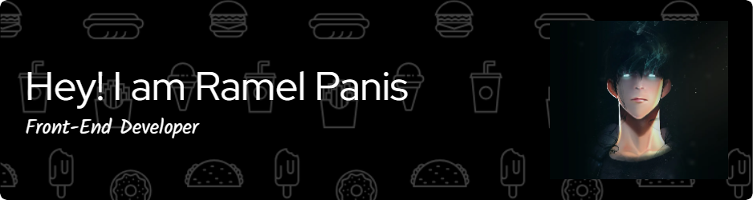

<body style="background:white;">

  

    

<h1 align="center">Hi 👋, I'm Ramel O. Panis Jr.</h1>
<h3 align="center">A passionate Frontend Developer from the Philippines</h3>

- 🔭 I’m currently working on **Todo List - A simple yet efficient task management app.**

- 🌱 I’m currently learning **Nextjs, Vue, Tailwindcss and and advanced GSAP animations**

- 👯 I’m looking to collaborate on **large-scale frontend projects – Reach out if you're interested!**

- 🤝 I’m looking for help with **open-source contributions – Let’s build something great together.**

- 👨‍💻 All of my projects are available at Portfolio: www.behance.net/ramelpanis

- 💬 Ask me about **Ask me about React, Angular, and GSAP – I love sharing knowledge!**

- 📫 How to reach me **Email: ramelpanisjr.06@gmail.com**

- ⚡ Fun fact **I can debug a React app faster than I can decide what to eat for lunch! 😆**

<h3 align="left">Connect with me:</h3>

<h3 align="left">Languages and Tools:</h3>

                                  

## 🧩 GitHub Stats

  
  

  

---

## 📬 Connect With Me

  
  
  
  

---

## ⚡ Fun Facts
- 🎸 Plays guitar and loves music  
- 🏀 Enjoys basketball and cycling  
- 💪 Rebuilding muscle & strength  
- 💻 Fixes electronics for fun  
- 🎮 Gamer at heart — Valorant, GTA V, and Dota  

---

> _“Code with purpose, build with passion, and keep learning.”_  
> — **Kurt Russel Destrajo**